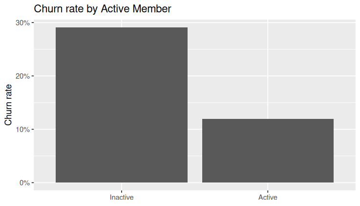
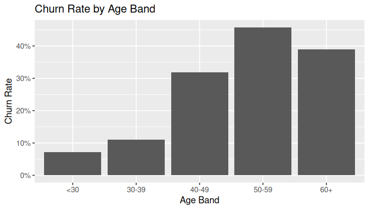
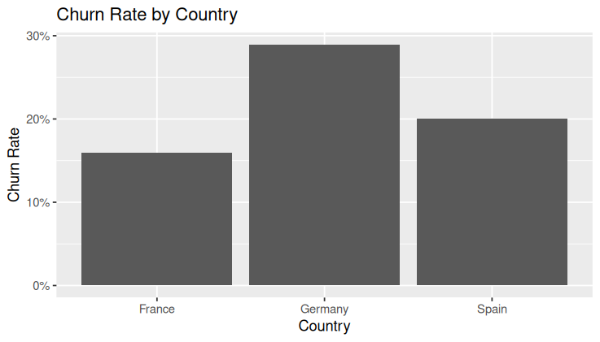

# Predicting-and-Explaining-Bank-Customer-Churn
Customer acquisition is expensive in fintech. The goal of this project is to idenfy customers at risk of churning and understand the key drivers behind churn to support retention strategy
# 📊 Bank Customer Churn Analysis (Exploratory Study)

## 📌 Project Overview

Customer retention is a critical challenge in fintech, where acquiring new customers is significantly more expensive than retaining existing ones.

The objective of this project is to:
- Explore patterns in customer churn
- Identify high-risk customer segments
- Derive actionable business insights
- Prepare the dataset for future predictive modeling

---

## 📂 Dataset Description

The dataset contains 1,000 bank customers with the following features:
- Customer ID  
- Credit Score  
- Country  
- Gender  
- Age  
- Tenure  
- Balance  
- Number of Products  
- Credit Card Ownership  
- Active Member Status  
- Estimated Salary  
- Churn (0 = Stayed, 1 = Left)

**Overall churn rate: 20.4%**

---

## 🧹 Data Cleaning & Preparation

Performed in Excel:
- Checked for missing values  
- Verified absence of duplicate Customer IDs  
- Converted text-formatted numeric columns to numeric values  
- Created additional variables:
  - `age_band`
  - `churn_numeric`
  - `high_low_balance`

---

## 📊 Exploratory Data Analysis

### 1️⃣ Active Membership

- Inactive churn rate: **29.1%**
- Active churn rate: **11.9%**

Inactive customers are more than twice as likely to churn.

---

### 2️⃣ Age Segmentation

| Age Band | Churn Rate |
|----------|------------|
| <30      | 7.1%       |
| 30–39    | 11.1%      |
| 40–49    | 31.8%      |
| 50–59    | 45.8%      |
| 60+      | 38.9%      |

Churn increases sharply after age 40.

---

### 3️⃣ Number of Products

- 1 product → 27.7%
- 2 products → 7.1%

Customers with multiple products churn significantly less.

---

### 4️⃣ Country

- Germany → 28.9%
- Spain → 20.1%
- France → 16%

German customers exhibit higher churn risk.

---

### 5️⃣ Gender

- Female → 25.9%
- Male → 15.6%

A moderate difference is observed between genders.

---

### 6️⃣ Balance Segmentation

- High balance → 25.0%
- Low balance → 15.8%

Higher-value customers show increased churn risk.

---

## 🔎 Key Insights

## 📊 Key Visual Insights

### Churn Rate by Active Member

Inactive customers show significantly higher churn compared to active customers.

---

### Churn Rate by Age Band

Churn increases substantially for customers aged 40+, peaking in the 50–59 age group.

---

### Churn Rate by Country

Germany shows the highest churn rate among

---

